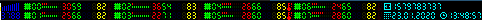

# MWStatusBar

Custom i3 status bar, using SFML library. Fast, simple project.

## Description

    It is my personal fast project with one source file. Built application is working in minimalistic pop-up window, with resolution similar to resolution of i3 status bar, included in i3 window environment. Resolution of the window and it's position is hardcoded at the beginning of main function.

    The application during first run, seraches local disk for files containing information about output of CPU temperature and fan speed sensors in order to show that information in status bar. Also creates temp_data and fan_data files in working directory.
Temperature measuring will be working only if there will be any information about temperature of every core of CPU.

    Despite of minimalistic size, status bar shows a lot of information:
    * system time
    * date and current time (also in seconds)
    * usage in % of particular thread of CPU core:
        * kernel time (red)
        * user time (green)
        * time used during waiting for end of I/O operations (blue)
    * temperature of core to which a thread belongs
    * speeds of fans installed in computer

    Information is updated every 100 ms.

## Screenshots
    
    
    
    <i>During searching files with information about sensors.</i>
    
    
    
    <i>During idle state.</i>
    
    
    
    <i>During virtual machine working.</i>
    
    
    
    <i>During some stress test.</i>
    
    
    
    <i>During some stress test with warning about high CPU temperature.</i>
    

## Dependencies

    This application uses SFML library. You can install it with:
    ```
    sudo apt install libsfml-dev
    ```

## Features that will be implemented in future

    * showing information about RAM and SWAP
    * showing information about I/O operations (including network I/O)
    * showing information about processes which user should pay an attention
    * showing detailed information during move cursor over particular parts of status bar

